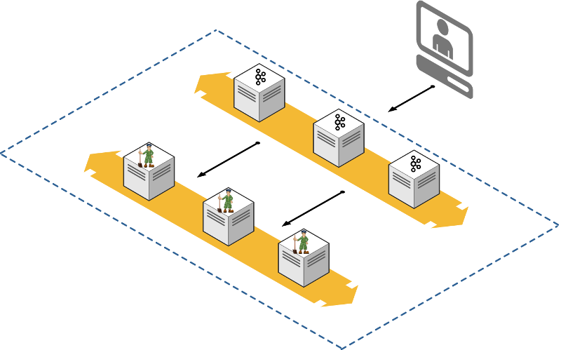
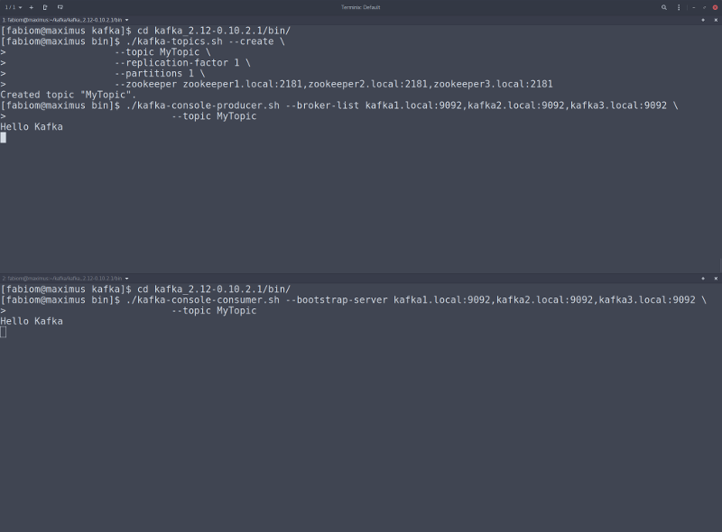

# Did I hear web scale message processing?
Usually it takes to long to prepare the environment every time we need to study something related to Kafka, basically because if you want to run tests in a environment with the minimum requirements for HA you need at least 3 servers for Zookeeper and 3 servers for kafka, all to ensure HA and avoid split brain.

If you are new to Kafka, I strongly recommend going through [kafka documentation](https://kafka.apache.org/documentation/), you can also take a look in [this course](https://www.youtube.com/watch?v=gg-VwXSRnmg&list=PLkz1SCf5iB4enAR00Z46JwY9GGkaS2NON), which is basic but extremely helpful.

To make it pratical, I also prepared the [zookeeper](https://zookeeper.apache.org/) and [kafka](https://kafka.apache.org/) to be both managed by [systemd](https://www.freedesktop.org/wiki/Software/systemd/), which means you can manage the services like this:
```bash
$ sudo systemctl start zookeeper
$ sudo systemctl stop zookeeper
$ sudo systemctl restart zookeeper

$ sudo systemctl start kafka
$ sudo systemctl stop kafka
$ sudo systemctl restart kafka
```

# Before we start
I'm assuming that you are an experienced GNU/Linux user, and that you have [ansible](https://www.ansible.com/), [vagrant](https://www.vagrantup.com/) and [virtualbox](https://www.virtualbox.org/) installed on your machine. As a host, I use [fedora](https://getfedora.org/), but you can choose whatever GNU/Linux distro you prefer.

# Tools on my desktop
<p align="center">
  
</p>

# Tools installed on VMs by the playbooks
<p align="center">
  
</p>

# Features
* Create and boot VirtualBox instances
* Provision the hosts with all necessary basic tools
* Provision a cluster for [zookeeper](https://zookeeper.apache.org/)
* Provision a cluster for [kafka](https://kafka.apache.org/)
* Automatic SSH key generation to access your hosts through vagrant  
:scream:

# Topology
<p align="center">
  
</p>

# Playbook structure
```bash
$ tree provisioning/
provisioning/
├── kafka-playbook.yml
├── roles
│   ├── general
│   │   ├── handlers
│   │   │   ├── main.yml
│   │   │   └── restart-mdns.yml
│   │   └── tasks
│   │       ├── main.yml
│   │       ├── packages.yml
│   │       └── security.yml
│   ├── kafka
│   │   ├── files
│   │   │   └── kafka.service
│   │   ├── handlers
│   │   │   ├── main.yml
│   │   │   └── restart-kafka.yml
│   │   ├── tasks
│   │   │   ├── create-configuration.yml
│   │   │   ├── create-npa.yml
│   │   │   ├── install-kafka.yml
│   │   │   ├── main.yml
│   │   │   └── manage-service.yml
│   │   ├── templates
│   │   │   └── server.properties.j2
│   │   └── vars
│   │       └── main.yml
│   └── zookeeper
│       ├── files
│       │   └── zookeeper-3.4.10.tar.gz
│       ├── handlers
│       │   ├── main.yml
│       │   └── restart-zookeeper.yml
│       ├── tasks
│       │   ├── create-configuration.yml
│       │   ├── create-npa.yml
│       │   ├── install-zookeeper.yml
│       │   ├── main.yml
│       │   └── manage-service.yml
│       ├── templates
│       │   ├── zoo.cfg.j2
│       │   └── zookeeper.service.j2
│       └── vars
│           └── main.yml
└── zookeeper-playbook.yml

16 directories, 28 files
```

# Bringing up your own environment
After clone my repo, navigate to the project folder and update the lines 3 and 4 from [Vagrantfile](Vagrantfile) to match your main network (the one with internet access) then, use vagrant to provision your own environment.  

```bash
$ git clone https://github.com/fabiogoma/kafka-ansible-virtualbox.git
$ cd kafka-ansible-virtualbox
$ vi Vagrantfile
```
```ruby
...
  #Replace eno1 with the apropriate name for your host main interface
  config.vm.network 'public_network', bridge: "eno1"
...
```
```bash
$ vagrant up
```

In a few minutes you should have have access to a cluster containing 3 hosts for zookeeper and 3 hosts for kafka, if you need more hosts you can change the host variables (zookeeper_boxes and kafka_boxes) on [Vagrantfile](Vagrantfile).

As soon as you have your topology up and running, download the [kafka binaries](http://apache.mirror.triple-it.nl/kafka/0.10.2.1/kafka_2.12-0.10.2.1.tgz) to your desktop. 

You need kafka binaries on your host to execute a basic test and make sure the topology is working so the tarball need to be exploded to be used.

```bash
$ wget http://apache.mirror.triple-it.nl/kafka/0.10.2.1/kafka_2.12-0.10.2.1.tgz
$ tar -xvzf kafka_2.12-0.10.2.1.tgz
$ cd kafka_2.12-0.10.2.1/bin
```

From now on we're gonna use 2 terminals, I recommend [tilix](https://github.com/gnunn1/tilix) (former terminix) to make it more productive

<p align="center">
  
</p>

Be careful with the sequence, because here it matters:
* Create topic (First terminal)
* Connect to the topic and wait for new messages (Second terminal)
* Send some test messages (First terminal)  

### First Terminal
```bash
./kafka-topics.sh --create \
                  --topic MyTopic \
                  --replication-factor 1 \
                  --partitions 1 \
                  --zookeeper zookeeper1.local:2181,zookeeper2.local:2181,zookeeper3.local:2181  
```
### Second Terminal
```bash
./kafka-console-consumer.sh --bootstrap-server kafka1.local:9092,kafka2.local:9092,kafka3.local:9092 \
                            --topic MyTopic
```
### First Terminal
```bash
./kafka-console-producer.sh --broker-list kafka1.local:9092,kafka2.local:9092,kafka3.local:9092 \
                            --topic MyTopic
```
Here, type some "Hello World" messages, hit enter and monitor the second terminal.

:orange_book: **Keep in mind that this is my personal laboratory, you can prepare you're production environment following this steps, but make sure you know what you're doing.**
